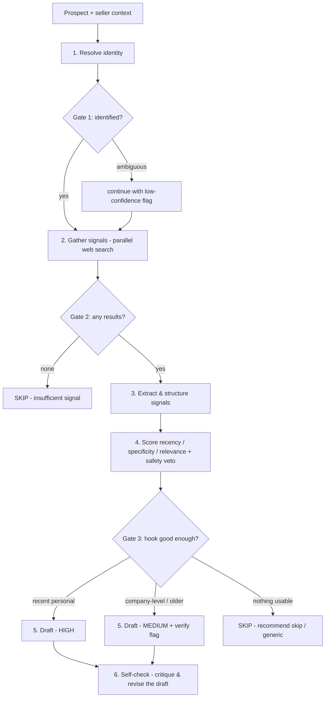

# SignalDraft

**Personalised cold-outreach drafting that shows its work.**

SignalDraft takes one prospect (a finance leader) plus who you're selling, then
researches them across the public web, decides whether there's a *good enough*
reason to reach out, and either drafts a short grounded email or honestly tells
you to skip. Every run streams live, stage by stage, so you can watch the
judgment happen — and every decision is explained, not hidden behind a black box.

Built as a case study for the Zamp AI Solutions Associate role (problem PS-3).

---

## The problem it solves

Under deadline pressure, SDRs degrade from deep personalised research to generic
copy-paste. The hard part was never *finding* signals about a prospect — it's the
**judgment** of which signal is recent, specific, relevant, and *safe* enough to
build a hook around. SignalDraft automates that judgment and makes it visible, so
a rep can trust it and delegate it.

It produces one of three honest verdicts per prospect:

| Verdict | Meaning | What you get |
|---|---|---|
| **HIGH** | A recent, person-specific, safe signal | A draft opening with that specific hook, source cited |
| **MEDIUM** | Only company-level or older signal | A company-level draft, flagged "verify before sending" |
| **SKIP** | No usable signal (or only unsafe signal) | No draft — an honest recommendation to skip, with the reason |

A SKIP is a feature, not a failure: declining to send a bad email is the right
call, and the tool says so plainly.

---

## How it works

The system is split into two clean halves:

1. **A judgment engine** (`lib/`) — framework-agnostic TypeScript that runs and is
   tested entirely from a terminal, with no web server involved.
2. **A thin web layer** (`app/`, `components/`) — Next.js API routes and React UI
   that call into the engine and render its output live.

This separation is deliberate: the engine could be lifted out and reused
anywhere, and UI problems can never block engine work (or vice versa).

### The pipeline

A run is a fixed six-stage sequence with **code-driven gates** between stages —
not an autonomous agent. The fixed shape is what makes it reliable, explainable,
and demonstrable. (The sixth stage, self-check, runs only when there is a draft to
review.)



1. **Resolve** — Claude turns the form input into a single best-guess identity. If
   it's ambiguous (a common name), the run continues anyway with a low-confidence
   flag rather than blocking.
2. **Gather** — seven targeted web searches fire in parallel through Tavily,
   deduped by URL. The set is weighted toward the highest-intent signal types: a
   leadership change and a funding/M&A event each get a dedicated query pulling more
   results, while lower-intent personal content (interviews, podcasts, talks) is
   consolidated into fewer. One slow or failing query never sinks the stage —
   whatever the others return is kept.
3. **Extract** — Claude reads the raw results and keeps only the real, on-topic,
   right-person signals, dropping noise. It returns kept results *by index*; the
   code rebuilds each source URL from the real search result, so links are never
   hallucinated.
4. **Score** — pure code computes each signal's recency, specificity
   (person > company), and relevance into a single 0–1 score, then multiplies by a
   per-archetype "signal strength" weight so a funding round or a new-exec move
   outranks a podcast clip at otherwise-equal scores. A **safety veto** disqualifies
   negative news (layoffs, lawsuits) as a hook — it's kept and flagged "found but
   not used", never built on.
5. **Draft** — for HIGH/MEDIUM, Claude writes a short, human-sounding email built on
   Josh Braun's 4T structure (Trigger, Think, Third-party proof, Talk), grounded
   *only* in the chosen signal (no invented facts, no AI tells). For SKIP, no email
   is written — just a plain recommendation and reason.
6. **Self-check** — Claude reviews its own draft against the same bar (grounding, the
   4T structure, no AI tells) and either passes it or returns a tightened version;
   the revised draft is what gets saved. On by default and shown as its own stage. A
   failed self-check never sinks the run — the original draft is kept. The
   no-em-dash rule (the most common AI tell) is enforced in *code* on both the draft
   and this review, so it's guaranteed rather than merely requested.

### Why the verdict is decided by code, not by Claude

This is the core design choice. Claude *describes and reads* each signal (what it
is, when, who it's about, how relevant); deterministic code *decides* the verdict
using tunable weights and thresholds in [`lib/config.ts`](lib/config.ts). That
keeps the judgment explainable ("this scored MEDIUM because the only fresh signal
was company-level"), reproducible, and tunable without touching any logic — which
is the whole "show its work" pitch.

---

## Key design decisions

These are the choices that shaped the build (the full rationale lives in the
[plan](docs/plans/2026-05-28-001-feat-signaldraft-build-plan.md)):

- **Prompt-chaining with code gates, not an autonomous agent** — a fixed sequence
  is reliable and explainable; an agent that decides its own steps is neither.
- **The engine is framework-agnostic and testable from a terminal** before any
  screen exists — the single biggest de-risking choice.
- **Claude judges, code computes the verdict** — see above.
- **Structured outputs + Zod for all Claude JSON** — Claude is *constrained* to
  return data matching a schema, so there's no fragile hand-parsing or retrying on
  malformed JSON.
- **The draft checks its own work, and the format rules are enforced in code** — a
  sixth self-check stage re-runs the draft against the grounding and no-AI-tells bar
  and revises it before you see it; the no-em-dash rule is applied in code, not just
  requested in the prompt, so a quality rule can't silently slip through. The
  self-check is best-effort: if it fails, the original draft is kept and the run
  still completes.
- **Live streaming run view** — each stage's real data streams to the browser as
  newline-delimited JSON, so you watch the judgment unfold instead of staring at a
  spinner. The UI *derives* the gate decisions from the stage events it already
  has.
- **One shared run history in Upstash Redis** — every visitor sees the same
  dashboard, on any device, with no login. Writes use atomic Redis list operations
  (not a read-modify-write of one big array) to stay race-free, and records carry a
  30-day TTL so public personal data isn't kept forever.
- **Public-demo safety controls** — the deployed app is unauthenticated and every
  run spends real API money, so: a hard spend cap in the Anthropic/Tavily
  dashboards (the real backstop), a per-IP rate limit (5 runs/hour → HTTP 429), and
  a form disclosure that runs are saved to a public dashboard.

---

## Running it locally

Requires Node.js 20+ and your own API keys.

```bash
# 1. Install dependencies
npm install

# 2. Set up your keys
cp .env.example .env.local
# then edit .env.local and fill in:
#   ANTHROPIC_API_KEY=sk-ant-...   (https://console.anthropic.com/)
#   TAVILY_API_KEY=tvly-...        (https://app.tavily.com/)
# The Upstash keys are optional locally — without them the app uses an
# in-memory store (runs aren't shared and are lost on restart; fine for dev).

# 3. Run the dev server
npm run dev          # http://localhost:3000

# 4. Run the tests
npm test             # 61 offline tests (no network, no API spend)
```

**Live tests** (real Claude + Tavily calls, skipped by default so the normal suite
never spends money) are gated behind a `LIVE=1` flag:

```bash
set -a && . ./.env.local && set +a && LIVE=1 npx vitest run <file>
```

---

## Deploying

The app is built to deploy on **Vercel** with **Upstash Redis** for shared
run history:

1. Push this repo to GitHub.
2. Import it into Vercel (it auto-detects Next.js — no build config needed).
3. Add **Upstash for Redis** from the Vercel Marketplace; it injects the
   `KV_REST_API_URL` / `KV_REST_API_TOKEN` env vars automatically.
4. Add `ANTHROPIC_API_KEY` and `TAVILY_API_KEY` to the Vercel project's
   environment variables.
5. Deploy.

No code changes are needed to switch from local to production: the store in
[`lib/kv.ts`](lib/kv.ts) auto-selects the real Upstash backend the moment those
env vars are present, and falls back to in-memory otherwise.

---

## Project layout

```text
lib/                  The judgment engine (framework-agnostic TypeScript)
  pipeline/           The six stages + the orchestrator that streams events
    index.ts          Orchestrator: runs stages in order, yields a StageEvent each
    resolve.ts        Stage 1 + Gate 1 (identity)
    gather.ts         Stage 2 + Gate 2 (archetype-weighted parallel web search)
    extract.ts        Stage 3 (Claude filters raw results to real signals)
    score.ts          Stage 4 + Gate 3 (code scoring, archetype tiers, safety veto)
    draft.ts          Stage 5 (grounded 4T email, or null for SKIP)
    selfcheck.ts      Stage 6 (the draft critiques and may revise itself)
  prompts/            The Claude prompts for resolve / extract / draft / self-check
  config.ts           Every tunable knob: model ids, weights, archetype tiers, gates
  types.ts            The shared vocabulary (Prospect, Signal, Verdict, RunRecord)
  anthropic.ts        Claude client wrapper (text + structured output)
  tavily.ts           Tavily search wrapper
  kv.ts / store.ts    The run store (Upstash Redis, with in-memory dev fallback)
  ratelimit.ts        Per-IP rate limit
  stats.ts            Dashboard summary metrics (a tested pure function)
  runQuery.ts         Dashboard filter + sort (a tested pure function)
  csv.ts              CSV parser for batch input (a tested pure function)

app/                  The Next.js web layer
  page.tsx            Home: prospect form + live streaming run view
  dashboard/page.tsx  Run history + summary stats + filter/sort
  batch/page.tsx      CSV batch: run up to five prospects through the engine
  runs/[id]/page.tsx  Reopen any saved run by URL
  api/run/route.ts    POST: runs the pipeline, streams stage events, saves the run
  api/runs/...        GET: history list + one run by id

components/           The React UI (form, live timeline, output card, dashboard, theme)
docs/                 The thinking behind the build (see below)
```

---

## The thinking behind it

This was built deliberately, decision by decision. The reasoning is documented:

- [`STRATEGY.md`](STRATEGY.md) — the product strategy: problem, users, metrics.
- [`docs/brainstorms/`](docs/brainstorms/) — the requirements exploration.
- [`docs/plans/`](docs/plans/) — the full build plan, day by day, with every key
  technical decision and its rationale.
- [`docs/sessions/`](docs/sessions/) — a log of each build session.

---

## Tech stack

Next.js 16 (App Router) · React 19 · TypeScript · Tailwind CSS 4 ·
Anthropic Claude (`claude-sonnet-4-6`) · Tavily · Upstash Redis · Vitest ·
deployed on Vercel.
