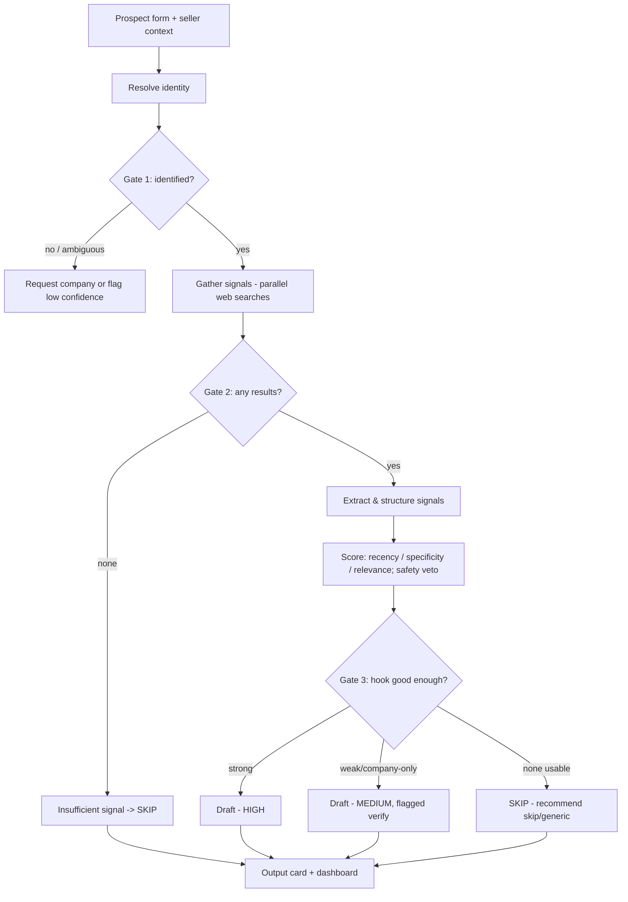

# SignalDraft — Requirements

## Summary

A single-prospect web app where an SDR enters a finance-leader prospect and watches the workflow run live — resolve → gather → score → draft — producing an editable, signal-grounded email with a HIGH / MEDIUM / SKIP verdict and visible reasoning, backed by a dashboard of past runs. Built as a Zamp AI Solutions Associate case study (problem statement PS-3, personalised outreach).

---

## Problem Frame

GTM/SDR reps source outreach signals manually across LinkedIn, news, and buyers' blogs. That sourcing is slow and doesn't scale within a campaign's time window, so reps start with deep personalised research but degrade to copy-pasting names onto generic-sounding drafts to hit deadlines. The hard part isn't *finding* signals — search returns plenty — it's the *judgment* of which signal is recent, specific, relevant, and safe enough to build a hook around. That judgment is what a tired rep skips at 5pm. SignalDraft automates the judgment and makes it visible, so the rep can trust and delegate it instead of going generic.

Full strategic context lives in `STRATEGY.md` at the repo root.

---

## Key Decisions

- **Prompt-chaining workflow, not an autonomous agent.** A fixed pipeline with programmatic gates between stages (per Anthropic's "Building Effective Agents"). Chosen for reliability, demonstrability, and explainability over open-ended autonomy.
- **Balanced 3-tier verdict (HIGH / MEDIUM / SKIP).** Over strict (quality-only) or lenient (always-draft). This surfaces the full range of judgment — a confident personal hook, a hedged company-level hook, and an honest skip — which is the core of the demo and feeds three of the four metrics.
- **Full-transparency live view is the target; progress + 1–2 line summaries is the fallback.** The live view is the embodiment of the "visible judgment" thesis, so we aim to stream real per-stage data. If live streaming proves too hard in the timeline, fall back to per-stage running/done status with short summaries.
- **Live searches, no caching.** Demo prospects hit live web search every run. Re-record the video if a search disappoints on a given day. Caching was considered and deferred — the video is the primary, re-recordable deliverable.
- **LinkedIn signals via compliant channels only.** A `site:linkedin.com` query through Tavily returns public snippets. No direct profile/post scraping. Clay enrichment is a possible later lever, not v1.
- **Foundational stack (decided upstream):** Next.js + TypeScript + Tailwind, Claude API for reasoning/drafting, Tavily for web search, deploy on Vercel.

---

## Actors

- A1. **SDR / GTM rep** — the user. Submits prospects, watches the run, reviews/edits/copies the draft. Decides whether to actually send (sending happens outside the tool).
- A2. **SignalDraft workflow** — the system. Runs the pipeline and makes each judgment visible.
- A3. **External services** — Claude (resolving, scoring, drafting) and Tavily (web search).
- A4. **Prospect (finance leader, CFO → Head of AP)** — the subject of research and the recipient of the eventual email. Not a user of the tool.

---

## Key Flows

- F1. **Standard run**
  - **Trigger:** Rep submits the prospect form.
  - **Actors:** A1, A2, A3
  - **Steps:** Resolve identity → Gate 1 (identified?) → Gather signals (parallel web searches) → Gate 2 (any results?) → Extract/structure signals → Score & rank → Gate 3 (hook good enough?) → Draft (HIGH/MEDIUM) or abstain (SKIP) → Output card.
  - **Outcome:** An output card with a confidence verdict, the chosen hook + reasoning, the ranked signals considered, and (for HIGH/MEDIUM) an editable draft — saved to the dashboard.
  - **Covered by:** R1, R4–R12, R15

---

## Requirements

**Input**

- R1. A single-prospect form with: Name (required), Company (required), Role/title (optional), LinkedIn URL or email (optional — used only as an identity hint, never scraped).
- R2. A seller-context panel, pre-filled with the finance-ops defaults (product, value prop, target buyer), editable and collapsible.
- R3. (Stretch) CSV upload to batch-process multiple prospects. If built, batch results feed the dashboard rather than the single-prospect live-run view.

**Signal intelligence (the judgment engine)**

- R4. Resolve the prospect to a single identity before searching. If ambiguous, request company/role or proceed with a low-confidence flag (Gate 1).
- R5. Gather signals via multiple web searches across sources — news, press, podcasts, conference talks, job postings, company blog, and a `site:linkedin.com` query — all through Tavily. If nothing is found, branch to insufficient-signal (Gate 2).
- R6. Extract each promising result into a structured signal: what happened, when, source, whether it's about the person or the company, and signal type. Drop noise (wrong person, stale, irrelevant).
- R7. Score each signal on Recency, Specificity (person > company > generic), and Relevance to the pitch. Apply Safety as a veto — negative news (layoffs, lawsuits) is disqualified regardless of other scores.
- R8. Produce one confidence verdict per run — HIGH, MEDIUM, or SKIP — using balanced gate strictness (Gate 3).

**Drafting**

- R9. For HIGH and MEDIUM, draft a short, human-sounding email grounded in the chosen hook. Cite only real signals; invent no facts; avoid AI tells (e.g. em-dashes, boilerplate phrasing).
- R10. For SKIP, produce no draft. Recommend "skip" or "use a generic template" with a plain-language reason.
- R11. (Stretch) A draft self-check pass that critiques a draft against specificity/grounding/tone and regenerates if it falls short.

**Output**

- R12. An output card showing: confidence badge (HIGH/MEDIUM/SKIP), editable draft (subject + body) with a copy button, the hook used and why it was chosen, the ranked signals considered with their scores and clickable source links, and flags (e.g. "negative news avoided," "company-level — verify before sending").

**UI surfaces**

- R13. A live run view where each stage (resolve → gather → extract → score → draft) visibly executes in sequence, with gates shown as decision points. Target: stream real intermediate data per stage. Fallback: per-stage running/done status with a 1–2 line summary.
- R14. A dashboard listing past runs (prospect, company, confidence tier, hook summary, date, status), with click-through to reopen any run's output card, and summary stats derived from the metrics.

**Instrumentation**

- R15. Each run records enough to compute the four metrics: time-to-draft, the confidence tier, whether a draft was produced or skipped, and the signals with their scores.

---

## Acceptance Examples

- AE1. **HIGH — confident personal hook.** **Given** a prospect with a recent, person-specific, relevant, safe signal, **when** the run completes, **then** the verdict is HIGH and the draft opens with a hook referencing that specific signal, with the source cited. **Covers R7, R8, R9.**
- AE2. **MEDIUM — hedged company hook.** **Given** only company-level signal (or a slightly older one), **when** the run completes, **then** the verdict is MEDIUM, the draft uses a company-level hook, and the card flags "verify before sending." **Covers R8, R9, R12.**
- AE3. **Thin/no signal → honest SKIP.** **Given** a prospect with no usable public signal, **when** the run completes, **then** no draft is produced and the system recommends skipping or using a generic template, with a plain reason. **Covers R8, R10.**
- AE4. **Negative news → safety veto.** **Given** the most recent signal is negative (layoffs/lawsuit), **when** scoring runs, **then** that signal is disqualified, the card notes it was found but deliberately not used, and the run either falls to a safe lower-tier signal or recommends caution. **Covers R7, R12.**
- AE5. **Common name → disambiguation.** **Given** an ambiguous name with weak company specificity, **when** Gate 1 runs, **then** the system requests the company/role or flags low confidence; once company is supplied, it resolves to one identity. **Covers R4.**

---

## Success Criteria

The four metrics (defined in `STRATEGY.md`), each checkable on the demo set:

- **Hook specificity rate** — share of HIGH/MEDIUM drafts whose hook is person-specific and recent vs generic/company-only.
- **Grounding fidelity** — share of draft claims that trace to a cited source; target zero invented facts.
- **Honest abstention rate** — share of thin-signal cases correctly routed to SKIP rather than a faked hook.
- **Time-to-draft** — seconds from prospect submission to a reviewed draft.

Quality bar:
- Drafts read as human-written (no AI tells).
- Every factual claim in a draft is backed by a cited signal.
- The live run view makes each stage's judgment visible (target) or at minimum legible (fallback).

Deliverable bar:
- A working build that runs end-to-end on real inputs.
- A demo (primary: video; live demo secondary) covering the happy path plus the three edge cases (SKIP, safety veto, disambiguation).

---

## Scope Boundaries

**Deferred for later (not v1):**
- CSV batch input (R3).
- Draft self-check loop (R11).
- Caching/snapshotting demo-prospect signals for reproducible runs.
- Clay enrichment for richer LinkedIn signal.

**Outside this product's identity (per `STRATEGY.md`):**
- Auto-sending emails — the human always reviews; the tool stops at a draft.
- Direct LinkedIn scraping — public snippets via search only.
- A fully autonomous agent — the pipeline is deliberately fixed with gates.

---

## Dependencies / Assumptions

- **Stack (foundational):** Next.js + TypeScript + Tailwind; Claude API; Tavily; Vercel for deploy.
- **API keys (user-provided):** Anthropic key (with credit) and Tavily key. Needed around Day 1–2.
- **Local toolchain:** Node.js installed (to be verified at build start).
- **Assumption:** the chosen demo prospects have findable public signal — verified with live searches on Day 1, when the 7 slots are filled with real names.
- **Assumption:** live search results are good enough at record time; mitigated by re-recording the video.
- **Timeline:** Day 1 = 2026-05-28; soft deadline 2026-06-02; hard deadline 2026-06-03.

---

## Outstanding Questions

**Resolve before planning:** none — all product decisions are settled.

**Deferred to planning:**
- The mechanism for streaming live per-stage data to the UI (target path) and the simpler fallback.
- Where and how run history is stored to power the dashboard.
- Exact prompt wording for each stage (resolve, extract, score, draft).
- Concrete scoring weights and the Gate 3 threshold — tuned during the build.
- UI visual styling within the chosen design system.
