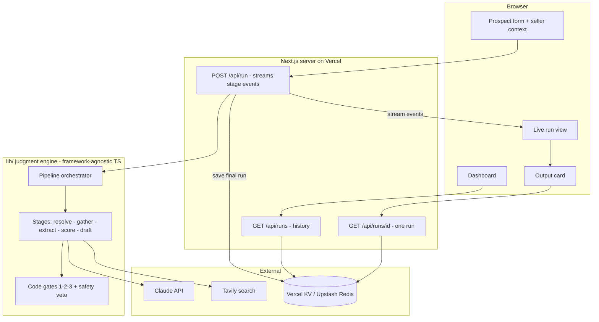
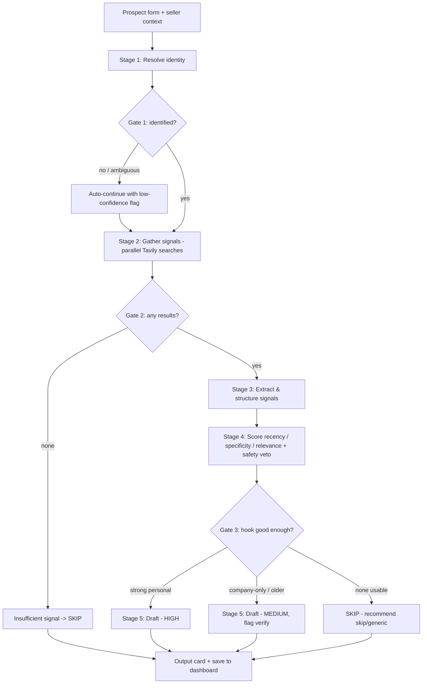

# feat: SignalDraft v1 build plan

## Summary

Build SignalDraft v1 as a Next.js app: a single-prospect workflow that resolves
a finance-leader prospect, gathers web signals through Tavily, scores them with
code-driven gates, and either drafts a grounded email or honestly recommends a
skip — streaming each stage live and saving every run to a shared dashboard.
Sequenced so the judgment engine works end-to-end on its own before any screen
exists, then the live UI is layered on top.

---

## Problem Frame

SDR/GTM reps degrade from deep personalised research to generic copy-paste under
deadline pressure. The hard part isn't *finding* signals — it's the *judgment* of
which signal is recent, specific, relevant, and safe enough to build a hook
around. SignalDraft automates that judgment and makes it visible, so the rep can
trust and delegate it. This plan turns the settled requirements
(`docs/brainstorms/2026-05-28-signaldraft-requirements.md`) and strategy
(`STRATEGY.md`) into a buildable, day-by-day sequence for a first-time builder
working to a soft deadline of 2026-06-02 and a hard deadline of 2026-06-03.

This plan is deliberately conservative on sequencing: the engine is finished and
testable from a terminal by Day 3, the full UI works locally by Day 5, the app is
deployed and demoed by Day 6 (soft deadline), and Day 7 is pure buffer. The
build-the-engine-first ordering means there is always a working artifact to fall
back on, which matters most when the builder is new to this.

---

## Day-by-Day Schedule

The work is grouped into five phases mapped onto the timeline. Each day ends with
a concrete, checkable milestone. Implementation Units (U1–U14) are defined in full
below; this table is the sequencing view.

| Day | Date | Phase | Units | End-of-day milestone |
|---|---|---|---|---|
| 1 | Thu 2026-05-28 | Foundation | U1, U2 | App runs locally (test runner ready); both API keys verified working |
| 2 | Fri 2026-05-29 | Engine spine + first stages | U3, U4, U5 | Pipeline runs with stubs; resolve + gather work on a real prospect |
| 3 | Sat 2026-05-30 | Finish engine | U6, U7 | **Full pipeline runs end-to-end from a terminal** (HIGH/MEDIUM/SKIP + draft) |
| 4 | Sun 2026-05-31 | Persistence + input | U8, U9 | Run store + history API work; run route streams correctly with pinned runtime config; prospect form submits a run |
| 5 | Mon 2026-06-01 | The experience | U10, U11, U12 | **Full single-prospect UX + dashboard work locally** |
| 6 | Tue 2026-06-02 | Ship (soft deadline) | U13, U14 | **Deployed to a public URL; demo video recorded** |
| 7 | Wed 2026-06-03 | Buffer (hard deadline) | fixes / re-record / stretch | Polished; stretch goals only if v1 is rock-solid |

The dashboard (U12) moved to Day 5 so the soft-deadline day (Day 6) holds only the
deploy and the demo recording — the two tasks with the least slack and a hard
external dependency (Vercel/KV setup). Stretch goals (draft self-check, CSV batch)
are queued for the Day 7 buffer — and beyond — only after v1 is solid. They are
next-up work, not abandoned (see Scope Boundaries).

If a day slips, the buffer absorbs it: the critical path is U1→U8 (a working
engine behind an API). UI units (U9–U12) are more parallelizable and more
forgiving.

---

## High-Level Technical Design

Two views: the system architecture (who talks to whom) and the pipeline flow
(the judgment sequence with its gates). These are authoritative shape, not
sketches.

### System architecture



### Pipeline flow (the judgment, with gates)

This is the **Standard run flow (F1** in the origin doc) that the implementation
units below reference by name.



---

## Output Structure

Greenfield Next.js app created at the repo root (alongside the existing
`STRATEGY.md` and `docs/`). Expected layout — the per-unit `Files` lists are
authoritative; this is the shape overview.

```text
app/
  layout.tsx
  page.tsx                 # home: prospect form + live run view (+ inline stream reader)
  globals.css
  dashboard/page.tsx       # run history + summary stats
  runs/[id]/page.tsx       # reopen a saved run's output card
  api/
    run/route.ts           # POST: run pipeline, stream stage events, save run
    runs/route.ts          # GET: list past runs
    runs/[id]/route.ts     # GET: one run record
    health/route.ts        # temporary: verify API keys (DELETED at end of U2)
lib/
  types.ts                 # Prospect, SellerContext, Signal, Verdict, StageEvent, RunRecord
  config.ts                # model id, scoring weights, gate thresholds, seller defaults, run cap
  anthropic.ts             # Claude client wrapper
  tavily.ts                # Tavily client wrapper
  store.ts                 # Vercel KV (Upstash): saveRun / listRuns / getRun
  ratelimit.ts             # per-IP run cap (KV-backed)
  pipeline/
    index.ts               # orchestrator: runs stages in order, emits events
    resolve.ts             # Stage 1 + Gate 1
    gather.ts              # Stage 2 + Gate 2
    extract.ts             # Stage 3
    score.ts               # Stage 4 + Gate 3 (scoring math, safety veto, verdict)
    score.test.ts          # automated tests for scoring + gates (Vitest)
    draft.ts               # Stage 5 (+ Stage 6 self-check, stretch)
  prompts/
    resolve.ts  extract.ts  relevance.ts  draft.ts
  store.test.ts            # optional safety-net tests for the run store (KV mocked)
components/
  ProspectForm.tsx  SellerContextPanel.tsx
  LiveRunView.tsx  StageCard.tsx
  OutputCard.tsx  VerdictBadge.tsx  SignalList.tsx
  DashboardTable.tsx
vitest.config.ts           # test runner config (set up in U1)
.env.local                 # API keys, gitignored
.env.example               # documents required keys
```

---

## Key Technical Decisions

- **KTD1 — Prompt-chaining pipeline with code gates, not an autonomous agent.**
  Fixed sequence (resolve → gather → extract → score → draft) with programmatic
  gates between stages. Chosen for reliability, demonstrability, and
  explainability (see origin: `docs/brainstorms/2026-05-28-signaldraft-requirements.md`).

- **KTD2 — The judgment engine is framework-agnostic TypeScript in `lib/`,
  separate from Next.js routes and React.** You can run and test the entire
  engine from a terminal before any screen exists; the API route just calls into
  it. This is the single biggest de-risking choice for a first-time builder — UI
  problems can't block engine progress and vice versa.

- **KTD3 — Live updates via a streamed HTTP response from a Next.js Route
  Handler** (newline-delimited JSON stage events), read by a small client reader
  (inline in `app/page.tsx`) that renders each stage as it arrives. To stop
  Vercel's serverless runtime from buffering the stream (which would defeat the
  whole live feel), the run route pins its config up front:
  `export const runtime = 'nodejs'`, `export const dynamic = 'force-dynamic'`,
  `export const maxDuration = 60`, and a `ReadableStream` response with
  `Content-Type: application/x-ndjson` and no compression. Build a plain,
  non-streaming end-to-end run first; add streaming as a layer on top. Fallback if
  streaming still misbehaves: render per-stage status from a single final response.

- **KTD4 — Run history in Vercel KV (Upstash Redis) as a single global shared
  list of run records.** No SQL, no schema. As of 2026 this is provisioned through
  the **Upstash for Redis** integration in the Vercel Marketplace (the old
  first-party "Vercel KV" was folded into it); the integration auto-injects env
  vars (`KV_REST_API_URL`, `KV_REST_API_TOKEN`) and `lib/store.ts` uses the
  `@upstash/redis` client (`Redis.fromEnv()`). Writes use atomic Redis list ops
  (`LPUSH` a run id onto a `runs` list + `SET` the record by id), never a
  read-modify-write of one JSON array — that is the race KTD's alternatives
  avoided. Records carry a TTL (e.g. 30 days) so public personal data isn't kept
  forever. Alternatives rejected: browser `localStorage` (per-browser, not
  shareable); Vercel Blob (race-prone read-modify-write); a SQL database (heavier
  setup and code than a demo needs).

- **KTD5 — The verdict is decided by code, not by Claude.** Claude extracts each
  result into a structured signal (what / when / source / person-vs-company /
  type) and gives a relevance read; code computes the recency / specificity /
  relevance scores, applies the safety veto, and runs the three gates to choose
  HIGH / MEDIUM / SKIP. Keeps the gates deterministic, explainable, and tunable —
  the core of the "show its work" pitch. Weights and the Gate-3 threshold are
  tuned during the build (see Open Questions).

- **KTD6 — One Claude model across all steps by default,** with the drafting step
  swappable if writing quality needs a bump. Use the **exact API model id
  strings** in `lib/config.ts`, not the display names: default
  `claude-sonnet-4-6`; the swap option for drafting is `claude-opus-4-7`. (A
  "model not found" error means a stale id, which is a different problem from a
  401 invalid-key error — useful to know on Day 1.) Predictable, lower cost;
  simple mental model.

- **KTD7 — Tavily for all web search,** including LinkedIn via a
  `site:linkedin.com` query (public snippets only, never scraped). Multiple
  targeted queries fired in parallel across source types (see origin).

- **KTD8 — Seller context is a fixed default object** (the finance-ops pitch),
  editable in the UI and passed into the pipeline so relevance scoring stays
  grounded (origin R2).

- **KTD9 — All external API calls run server-side; keys live in environment
  variables** (`.env.local` locally, Vercel project settings in production) and
  are never shipped to the browser. Protects the keys and the API spend.

- **KTD10 — Public-demo safety controls** (because the deployed app is
  unauthenticated by design and `POST /api/run` spends real money on every call):
  (1) set a **hard spend cap / billing alert in the Anthropic and Tavily
  dashboards** — the zero-code backstop against a runaway bill, do this Day 1;
  (2) a **lightweight per-IP run cap** in KV (`lib/ratelimit.ts`, e.g. 5 runs per
  IP per hour → HTTP 429) guarding `POST /api/run`; (3) a **one-line disclosure**
  on the prospect form that runs are saved to a public dashboard, so no
  confidential data is entered, plus the record TTL from KTD4.

---

## Requirements

Carried from the origin requirements doc, grouped by capability. R-IDs are stable.

**Input**

- R1. Single-prospect form: Name (required), Company (required), Role/title
  (optional), LinkedIn URL or email (optional — identity hint only, never scraped).
- R2. Seller-context panel pre-filled with finance-ops defaults, editable and
  collapsible.

**Signal intelligence (the judgment engine)**

- R4. Resolve the prospect to a single identity before searching; if ambiguous,
  proceed with a low-confidence flag (Gate 1; non-blocking in v1).
- R5. Gather signals via multiple parallel web searches across sources (news,
  press, podcasts, talks, job postings, company blog, `site:linkedin.com`) through
  Tavily; if nothing is found, branch to insufficient-signal (Gate 2).
- R6. Extract each promising result into a structured signal (what / when / source
  / person-vs-company / type); drop noise.
- R7. Score each signal on recency, specificity (person > company > generic), and
  relevance to the pitch; safety is a hard veto — negative news (layoffs,
  lawsuits) is disqualified regardless of other scores.
- R8. Produce one confidence verdict per run — HIGH, MEDIUM, or SKIP — using
  balanced gate strictness (Gate 3).

**Drafting**

- R9. For HIGH and MEDIUM, draft a short, human-sounding email grounded in the
  chosen hook; cite only real signals, invent no facts, avoid AI tells.
- R10. For SKIP, produce no draft; recommend "skip" or "use a generic template"
  with a plain-language reason.

**Output**

- R12. Output card showing: confidence badge, editable draft (subject + body)
  with a copy button, the hook used and why, the ranked signals with scores and
  clickable source links, and flags ("negative news avoided", "company-level —
  verify before sending").

**UI surfaces**

- R13. A live run view where each stage visibly executes in sequence, with gates
  shown as decision points; target is streamed real per-stage data, fallback is
  per-stage running/done status with a short summary.
- R14. A dashboard listing past runs (prospect, company, tier, hook summary, date,
  status) with click-through to reopen any run, plus summary stats.

**Instrumentation**

- R15. Each run records enough to compute the four metrics: time-to-draft, the
  confidence tier, whether a draft was produced or skipped, and the signals with
  their scores.

**Stretch (queued, not abandoned)**

- R3. CSV upload to batch-process multiple prospects (results feed the dashboard).
- R11. Draft self-check pass (Stage 6) that critiques and regenerates a draft.

---

## Implementation Units

### U1. Project scaffold & app shell

- **Goal:** A running Next.js + TypeScript + Tailwind app at the repo root with a
  basic styled layout you can open in the browser, plus the test runner ready.
- **Requirements:** Foundational (enables all).
- **Dependencies:** none.
- **Files:** `package.json`, `app/layout.tsx`, `app/page.tsx`, `app/globals.css`,
  Tailwind config, `vitest.config.ts`, `.gitignore`, `.env.example`.
- **Approach:** Run `create-next-app` at the repo root, accepting the TypeScript +
  Tailwind + App Router defaults. Add a minimal layout (app title "SignalDraft", a
  centered content container). Install and configure **Vitest** now so the test
  runner is established Day 1 (not discovered mid-build on Day 3); add a `test`
  script. Initialize git. Confirm the dev server serves the page and an example
  test runs.
- **Patterns to follow:** create-next-app conventions; Vitest's Next.js setup.
- **Test scenarios:** A trivial example test passes (proves the runner works);
  otherwise verification is the app running.
- **Verification:** The dev server serves a styled page showing the SignalDraft
  title with no console errors; `npm test` runs the example test green.

### U2. API keys, env config & external service clients

- **Goal:** Anthropic and Tavily keys loaded from env; thin client wrappers that
  each make one successful call; a tiny check confirms both work; spend caps set.
- **Requirements:** Enables R4–R9 (all AI/search); KTD9, KTD10. Day 1–2 dependency.
- **Dependencies:** U1.
- **Files:** `.env.local` (gitignored), `.env.example`, `lib/anthropic.ts`,
  `lib/tavily.ts`, `lib/config.ts`, temporary `app/api/health/route.ts`.
- **Approach:** Install the Anthropic SDK (`@anthropic-ai/sdk`) and the Tavily
  SDK. `lib/anthropic.ts` wraps a single message call using the configured model
  id (`claude-sonnet-4-6`, from `lib/config.ts`). `lib/tavily.ts` wraps a single
  search query. The health route runs one tiny Claude call and one tiny Tavily
  search and returns both results. Keys are read server-side only (KTD9). **Set a
  hard spend cap / billing alert in both the Anthropic and Tavily dashboards now**
  (KTD10). **Delete `app/api/health/route.ts` once both clients are confirmed —
  this file must not exist past Day 1** (a public route that calls Claude on every
  hit is a cost and key-validity leak).
- **Patterns to follow:** SDK quickstart usage; env via `process.env`.
- **Test scenarios:**
  - Happy path: the health check returns a short Claude completion and at least
    one Tavily result for a known query.
  - Error path: with a missing or invalid key, the wrapper throws a clear,
    readable error rather than crashing (and a model-not-found error reads
    differently from a 401 — a stale model id, not a bad key).
- **Verification:** Hitting the health route prints a Claude reply and Tavily
  results; removing a key produces a clear error message; the health route is
  deleted and spend caps are confirmed in both dashboards.

### U3. Shared types & pipeline orchestrator skeleton

- **Goal:** The data shapes plus the spine that calls each stage in order and
  emits a structured event per stage — with stub stages — so the flow runs
  end-to-end before any real logic exists.
- **Requirements:** Enables R4–R12, R15; F1.
- **Dependencies:** U2.
- **Files:** `lib/types.ts`, `lib/pipeline/index.ts`, stub
  `lib/pipeline/{resolve,gather,extract,score,draft}.ts`.
- **Approach:** Define `Prospect`, `SellerContext`, `Signal` (what / when / source
  / url / aboutPersonOrCompany / type / scores), `Verdict`
  (`'HIGH' | 'MEDIUM' | 'SKIP'`), `StageEvent` (stage name, status, payload), and
  `RunRecord` (id, prospect, verdict, hook, signals, draft, flags, timings,
  createdAt). The orchestrator walks the stages and gates, yielding a `StageEvent`
  at each step; stubs return fixed sample data. Record start/end timestamps for
  time-to-draft (R15).
- **Technical design (directional):** orchestrator as an async generator that
  `yield`s `StageEvent`s; each stage is a pure async function `(input) => output`.
- **Patterns to follow:** async generator emitting events; one pure function per
  stage.
- **Test scenarios:**
  - Happy path: running the orchestrator with stubs yields events in order
    (resolve → gather → extract → score → draft) and a final `RunRecord` with all
    required fields populated.
  - Edge: a failing gate short-circuits later stages and yields a terminating
    event (e.g., SKIP) without crashing.
- **Verification:** A small script runs the orchestrator and logs the ordered
  events and the final record shape.

### U4. Stage — Resolve identity + Gate 1

- **Goal:** Claude turns the form input into a single best-guess identity (or
  flags ambiguity); Gate 1 decides identified vs. ambiguous.
- **Requirements:** R4; AE5; F1.
- **Dependencies:** U3.
- **Files:** `lib/pipeline/resolve.ts`, `lib/prompts/resolve.ts`.
- **Approach:** Prompt Claude with name + company + role + hint + seller context;
  ask for a structured identity (canonical name, company, role, confidence,
  disambiguation note) as JSON. Parse defensively. Gate 1: if low confidence or
  ambiguous, **do not block — auto-continue to gather and attach a low-confidence
  flag to the run** (v1 is non-blocking; the flag is surfaced in the UI). This
  keeps the run flowing while making the judgment visible.
- **Patterns to follow:** structured-output prompt; tolerant JSON parsing.
- **Test scenarios:**
  - Happy path: a clear name + company resolves to one identity with high
    confidence and proceeds clean.
  - Covers AE5: a common name with weak company specificity returns ambiguous →
    Gate 1 attaches a low-confidence flag and continues; once company is supplied,
    it resolves to one identity. (Verified manually with a real ambiguous name.)
- **Verification:** Resolve returns one confident identity for a clear prospect and
  attaches a low-confidence flag for an ambiguous one without halting the run.

### U5. Stage — Gather signals via Tavily + Gate 2

- **Goal:** Run several targeted web searches in parallel across source types and
  collect raw results; Gate 2 branches if nothing usable comes back.
- **Requirements:** R5; AE3; F1.
- **Dependencies:** U4.
- **Files:** `lib/pipeline/gather.ts`.
- **Approach:** Build query templates from the resolved identity + company (news,
  press, podcasts, talks, job postings, company blog, `site:linkedin.com`). Fire
  them in parallel and collect title / snippet / url / published-date. Dedupe.
  Gate 2: if total usable results fall below a floor, branch to insufficient-signal
  (SKIP). **Cap the query count** (set in `lib/config.ts`) for cost, speed, and to
  keep a run inside the function time budget (KTD3 `maxDuration`).
- **Patterns to follow:** parallel fetch with `Promise.all`; defensive handling of
  empty results.
- **Test scenarios:**
  - Happy path: a well-known finance leader returns multiple results across
    queries.
  - Covers AE3: a no-footprint prospect returns almost nothing → Gate 2 routes to
    insufficient-signal / SKIP. (Manual, with a deliberately obscure prospect.)
  - Error path: if one query errors or times out, the others still return and the
    stage does not crash.
- **Verification:** Gather returns a deduped list of raw results for a real
  prospect; an obscure prospect triggers the SKIP branch.

### U6. Stage — Extract, score & verdict + Gate 3

- **Goal:** Turn raw results into structured signals (dropping noise), score each,
  apply the safety veto, and produce the HIGH / MEDIUM / SKIP verdict with
  code-driven gates.
- **Requirements:** R6, R7, R8; AE1, AE2, AE4; F1.
- **Dependencies:** U5.
- **Files:** `lib/pipeline/extract.ts`, `lib/pipeline/score.ts`,
  `lib/prompts/extract.ts`, `lib/prompts/relevance.ts`, `lib/pipeline/score.test.ts`.
- **Approach:** Extract — Claude reads each raw result and returns a structured
  signal or a "drop" for noise / wrong-person / stale. Score (code) — recency from
  the date, specificity (person > company > generic), relevance (Claude's relevance
  read mapped to a number); the safety veto disqualifies signals classified as
  negative (layoffs / lawsuit) but retains them with a "found-but-excluded" flag.
  Gate 3 (code) — pick the top safe signal; thresholds map to HIGH (strong recent
  personal signal), MEDIUM (company-level or older), SKIP (nothing usable). Weights
  and thresholds live in `lib/config.ts` and are tuned during the build (KTD5).
  (The Vitest runner is already set up from U1, so this unit is writing tests, not
  configuring tooling.)
- **Patterns to follow:** Claude for extraction/relevance, deterministic code for
  the math and gates (KTD5).
- **Test scenarios (automated — deterministic scoring/gates):**
  - Covers AE1: a recent, person-specific, safe signal scores into HIGH.
  - Covers AE2: a company-only or older signal scores into MEDIUM.
  - Covers AE4: only negative news present → the safety veto disqualifies it; the
    verdict drops to a safe lower signal or SKIP; the excluded signal keeps its
    flag.
  - Edge: an empty signal set yields SKIP.
  - Edge: given two signals, the more recent person-level one ranks first.
  - (Extraction itself is verified manually — Claude output is non-deterministic.)
- **Verification:** `score.test.ts` passes; running on a real prospect yields a
  sensible ranked list and verdict.

### U7. Stage — Draft / honest abstain

- **Goal:** For HIGH/MEDIUM, write a short, human-sounding email grounded only in
  the chosen real signal; for SKIP, produce no draft, just a plain recommendation
  and reason.
- **Requirements:** R9, R10; AE1, AE2, AE3.
- **Dependencies:** U6.
- **Files:** `lib/pipeline/draft.ts`, `lib/prompts/draft.ts`.
- **Approach:** Draft — Claude receives the chosen hook + its source + seller
  context, instructed to cite only the provided signal, invent no facts, avoid AI
  tells (no em-dashes, no boilerplate phrasing), and keep it short; returns subject
  + body. MEDIUM adds a "verify before sending" framing. SKIP — no Claude call;
  return the recommendation ("skip / use a generic template") plus a reason. (Stage
  6 self-check is a stretch hook here, off by default — see Scope Boundaries.)
- **Patterns to follow:** grounded-generation prompt constrained to provided facts.
- **Test scenarios:**
  - Covers AE1: HIGH → the draft opens with a hook referencing the specific
    signal, source cited. (Manual.)
  - Covers AE2: MEDIUM → company-level hook + verify-before-sending flag. (Manual.)
  - Covers AE3: SKIP → no draft; recommendation + plain reason. (Automated: the
    SKIP path returns a null draft and a reason string.)
  - Quality (manual): the draft has no em-dashes / obvious AI tells, and every
    factual claim traces to the cited signal.
- **Verification:** HIGH/MEDIUM produce a grounded draft; SKIP produces no draft
  with a reason. **Day 3 milestone: the full pipeline runs end-to-end from a
  terminal script.**

### U8. Run store (Vercel KV) + streaming run API + history API

- **Goal:** Save each completed run to the shared store and read runs back; expose
  the pipeline as a streaming POST endpoint and history as GET endpoints — built
  store-first, then streaming, so each piece is proven before the next.
- **Requirements:** R13 (transport), R14, R15; KTD10.
- **Dependencies:** U7.
- **Files:** `lib/store.ts`, `lib/ratelimit.ts`, `app/api/run/route.ts`,
  `app/api/runs/route.ts`, `app/api/runs/[id]/route.ts`, `lib/store.test.ts`
  (optional safety net).
- **Approach:** **Step 1 (prove persistence):** provision **Upstash for Redis** via
  the Vercel Marketplace and pull its env vars locally (`vercel env pull`). Write
  `lib/store.ts` with `@upstash/redis` (`Redis.fromEnv()`): `saveRun` (atomic
  `LPUSH` a run id onto a `runs` list + `SET` the record by id, with a TTL),
  `listRuns` (read the list newest-first, capped — cap in `lib/config.ts`, fetch
  records by id), `getRun(id)`. Build `app/api/run` first as a **plain
  non-streaming POST** that runs the orchestrator and returns the final JSON; the
  two GET routes return the list and one record. Confirm a run saves and reads
  back. **Step 2 (add streaming):** convert `app/api/run` to stream each
  `StageEvent` as newline-delimited JSON via a `ReadableStream`, with the runtime
  config pinned per KTD3 (`runtime='nodejs'`, `dynamic='force-dynamic'`,
  `maxDuration=60`, `Content-Type: application/x-ndjson`); save the `RunRecord` on
  completion and stream a final event. Guard `POST /api/run` with the per-IP run
  cap (`lib/ratelimit.ts`, KTD10) before invoking the pipeline. Record
  time-to-draft, tier, drafted-or-skipped, and signals + scores (R15).
- **Patterns to follow:** Next.js Route Handler returning a streamed `Response`;
  `@upstash/redis` client; atomic list ops.
- **Test scenarios (store — optional automated, KV mocked):**
  - Happy path: `saveRun` then `listRuns` returns it newest-first; `getRun` by id
    returns the full record.
  - Edge: `listRuns` on an empty store returns an empty list.
  - Edge: `getRun` with an unknown id returns null.
  - Rate limit (manual): the 6th run from one IP within the window returns 429.
  - API (manual): the plain POST saves a run; the streamed POST emits ordered
    events; GET `/api/runs` lists it; events arrive incrementally, not all at the
    end (proves no buffering).
- **Verification:** A run saves and reads back over the plain POST; after the
  streaming conversion, events arrive incrementally; the run appears in
  `/api/runs`; an over-limit IP is rejected.

### U9. Input surface — prospect form + seller-context panel

- **Goal:** The home screen where the rep enters a prospect and edits the seller
  context, then submits to start a run.
- **Requirements:** R1, R2; KTD10.
- **Dependencies:** U1 (shell); pairs with U8 for submission.
- **Files:** `app/page.tsx`, `components/ProspectForm.tsx`,
  `components/SellerContextPanel.tsx`, `lib/config.ts` (seller defaults).
- **Approach:** Form fields — Name (required), Company (required), Role (optional),
  LinkedIn/email hint (optional, identity hint only). Seller-context panel
  pre-filled with finance-ops defaults, collapsible and editable. A one-line
  disclosure under the form: "Runs are saved to a public dashboard visible to
  anyone with this link — don't enter confidential data" (KTD10). Submit calls
  `/api/run` and hands the stream to the live run view (U10). Basic client
  validation on required fields. **While a run is in progress, the submit button
  shows a disabled "Running…" state and the fields are read-only;** the
  seller-context panel auto-collapses on submit to give the live view space. On
  completion the form returns to editable (pre-filled) so the next prospect can be
  run immediately.
- **Patterns to follow:** controlled React form; Tailwind styling.
- **Test scenarios:**
  - Happy path (manual): filling the required fields enables submit; submitting
    starts a run and locks the form.
  - Edge (manual): a missing required field blocks submit with a clear message.
  - Edge (manual): a second submit is impossible while a run is active (button
    disabled).
  - Edge (manual): seller-context edits flow into the submitted run; the panel
    collapses on submit and can be re-expanded.
- **Verification:** The form submits and triggers a run, locks during the run, and
  restores afterward; validation blocks empty required fields; the disclosure is
  visible.

### U10. Live run view — streamed stage timeline with gates

- **Goal:** As a run streams, show each stage executing in sequence with its real
  data, show the gates as decision points, and handle the run finishing, skipping,
  or failing.
- **Requirements:** R13; F1.
- **Dependencies:** U8 (stream), U9 (submit).
- **Files:** `components/LiveRunView.tsx`, `components/StageCard.tsx`, inline stream
  reader in `app/page.tsx`.
- **Approach:** Read the streamed response body, parse newline-delimited JSON
  events, and update a per-stage timeline. **Each `StageCard` has four explicit
  states:** *pending* (not yet reached — dimmed, no spinner), *running* (spinner +
  label), *done* (check + short summary and its data), and *skipped/gated-out*
  (gate icon + one-line reason, e.g. "Skipped — Gate 2: no results"). Gates render
  as labeled decision points ("Gate 2: results found", "Gate 3: HIGH"); a Gate-1
  low-confidence result shows a small warning banner inside the Stage-1 card. On
  the final event, hand off to the output card (U11). **Error/timeout state:** if
  the stream closes without a final event, emits an error event, or no event
  arrives within a timeout (e.g. 90s), mark the current stage as failed with a
  short reason, keep completed stages visible, and show a "Run failed — retry"
  action. Fallback (KTD3): if streaming is buffered in prod, render stage statuses
  from a single final response. Keep the stream reader inline — no separate hook
  abstraction in v1 (single consumer).
- **Patterns to follow:** `fetch` + `ReadableStream` reader in the client;
  incremental state updates.
- **Test scenarios:**
  - Happy path (manual): stages light up in order with real data; gates show their
    decisions; the draft appears at the end.
  - Edge (manual): a SKIP run shows the gates routing to SKIP, downstream stages in
    the skipped state, and no draft.
  - Edge (manual): partial data is visible mid-run — it does not wait for the end.
  - Error path (manual): a forced mid-stream failure shows the failed-stage state
    and a retry action, not a frozen spinner.
- **Verification:** A live run visibly streams stage-by-stage for the happy path,
  SKIP, and a simulated mid-run error.

### U11. Output card — verdict, editable draft, ranked signals, flags

- **Goal:** The result surface for every verdict tier: verdict badge, editable
  draft with copy, the chosen hook + why, the ranked signals with scores and
  clickable sources, and flags — including a defined SKIP layout.
- **Requirements:** R12; AE1, AE2, AE4.
- **Dependencies:** U10 (produces it live); reused by U12 (reopen a saved run).
- **Files:** `components/OutputCard.tsx`, `components/VerdictBadge.tsx`,
  `components/SignalList.tsx`, `app/runs/[id]/page.tsx`.
- **Approach:** Verdict badge with explicit colors — **HIGH = green, MEDIUM =
  amber, SKIP = neutral gray (not red; SKIP is honest judgment, not a failure).**
  Editable subject + body as **plain textareas** (no rich-text library) with a
  copy-to-clipboard button that shows "Copied!" for ~2s on success and falls back
  to selecting the textarea text if the clipboard API is unavailable. A "why this
  hook" explanation. A ranked signal list — each with its scores, a source link
  (new tab), and a person/company tag. A flags row ("negative news avoided",
  "company-level — verify before sending"). **SKIP layout:** the draft area is
  replaced by the recommendation text + reason; `SignalList` still renders any
  extracted signals with a "why not used" note (this keeps the judgment visible for
  SKIP); the flag shows the SKIP cause (e.g. "Insufficient signal" vs "Negative
  news — no safe hook"). `app/runs/[id]/page.tsx` fetches a saved run (with a simple
  loading state) and renders the same card.
- **Patterns to follow:** one `OutputCard` reused for live and historical runs.
- **Test scenarios:**
  - Happy path (manual): a HIGH run shows the green badge, editable draft, working
    copy with "Copied!" feedback, hook reasoning, and ranked signals with working
    source links.
  - Covers AE4 (manual): a run with negative news shows the "found but not used"
    flag.
  - Edge (manual): a SKIP run shows the gray badge, no draft, the recommendation +
    reason, and the considered signals with "why not used".
  - Edge (manual): reopening a saved run by URL renders the same card.
- **Verification:** The output card renders correctly for HIGH, MEDIUM, and SKIP;
  copy works with feedback; sources open; the saved-run URL works.

### U12. Dashboard — run history, click-through, summary stats

- **Goal:** A dashboard listing past runs with click-through to reopen each, plus
  summary stats derived from the metrics, with a clean empty state.
- **Requirements:** R14, R15.
- **Dependencies:** U8 (history API), U11 (output card).
- **Files:** `app/dashboard/page.tsx`, `components/DashboardTable.tsx`.
- **Approach:** Fetch `/api/runs`; render a table (prospect, company, tier, hook
  summary, date, status); each row links to `/runs/[id]`. A summary strip computes
  from the run set: hook-specificity rate, grounding (drafts whose claims all
  trace to a cited signal), honest-abstention rate (SKIPs over thin cases), and
  average time-to-draft. **Empty state:** when there are no runs, show a centered
  "No runs yet — submit a prospect to get started" prompt and **hide the stats
  strip entirely** (don't render 0/0 or NaN%). Stats compute read-side from stored
  fields (R15).
- **Patterns to follow:** simple fetch + table; read-side stat computation.
- **Test scenarios:**
  - Happy path (manual): after several runs, the dashboard lists them
    newest-first; clicking a row opens its card.
  - Edge (manual): the empty state shows the friendly prompt and no stats strip.
  - Stat check (manual): the summary numbers match the visible runs.
- **Verification:** The dashboard lists runs, links work, the stats reflect the
  data, and the empty state is clean.

### U13. Deploy to Vercel + live smoke test

- **Goal:** The app live on a public Vercel URL, KV and keys already wired (from
  U8), verified end-to-end on the deployed link.
- **Requirements:** Deployment (origin Dependencies/Assumptions); R13/R14 in prod.
- **Dependencies:** U8–U12.
- **Files:** none new (Vercel dashboard config); optional `README.md` notes.
- **Approach:** Push the repo to GitHub; import it into Vercel; confirm the Upstash
  for Redis integration and `ANTHROPIC_API_KEY` / `TAVILY_API_KEY` are set in the
  Vercel project settings; deploy. Smoke test on the live URL: run a real prospect,
  confirm streaming flushes incrementally (the runtime config from KTD3/U8 should
  make this work first try), the run saves, and the dashboard shows it. If the
  stream buffers despite the config, fall back to the per-stage-status render
  (KTD3).
- **Patterns to follow:** Vercel Git integration; Marketplace storage.
- **Test scenarios:** Test expectation: none (deployment) — verification is the
  live smoke test.
- **Verification:** The public URL runs a full prospect end-to-end with visible
  streaming; the run persists and shows in the dashboard **from a different
  browser** (proves the shared-store choice, KTD4).

### U14. Demo prep — verify edge-case prospects, run live, record video

- **Goal:** Confirm the demo scenarios produce the intended verdicts on live data
  across all three tiers, then record the demo video.
- **Requirements:** Deliverable bar (origin Success Criteria); AE1–AE5.
- **Dependencies:** U13.
- **Files:** optional `docs/demo-script.md`.
- **Approach:** Choose and verify prospects for all five acceptance examples:
  happy path (**HIGH**), hedged company hook (**MEDIUM** — shows the middle tier
  and the "verify before sending" flag), honest **SKIP**, **safety veto** (negative
  news present), and **disambiguation** (common name). Run each live; if a live
  search disappoints on the day, swap the prospect or re-run (no caching, by
  design). Record the video covering all five, narrating the visible judgment.
  Keep a live-demo fallback path.
- **Patterns to follow:** origin demo bar.
- **Test scenarios:** Test expectation: none — this is verification/demo, covered
  by running AE1–AE5 live.
- **Verification:** A recorded video demonstrates HIGH, MEDIUM, SKIP, safety veto,
  and disambiguation on the live URL.

---

## Scope Boundaries

### Stretch — queued, not abandoned (post-v1)

- Draft self-check loop / Stage 6 (R11) — critique a draft against
  specificity/grounding/tone and regenerate if it falls short. The `draft.ts`
  approach leaves a hook for this. **Next-up if v1 is solid.**
- CSV batch input (R3) — batch-process multiple prospects; results feed the
  dashboard rather than the single-prospect live view. **Next-up if v1 is solid.**
- Caching/snapshotting demo-prospect signals for reproducible runs.
- Clay enrichment for richer LinkedIn signal.

### Outside this product's identity (per `STRATEGY.md`)

- Auto-sending emails — the tool always stops at a draft for human review.
- Direct LinkedIn scraping — public snippets via Tavily search only.
- A fully autonomous agent — the pipeline is deliberately fixed with code gates.

---

## Risks & Dependencies

- **API keys + credit + spend caps (Day 1–2).** Anthropic key with credit and a
  Tavily key must be set up before the engine does anything real, and a hard spend
  cap / billing alert set in both dashboards (KTD10) as the primary backstop
  against runaway cost. Handled on Day 1.
- **Unauthenticated cost-spending endpoint.** `POST /api/run` is public and spends
  money per call; an automated loop could drain credits. Mitigation: the per-IP run
  cap (KTD10) plus the dashboard spend caps. The rate limit is in-app defense; the
  spend cap is the hard ceiling.
- **Function timeout.** A run makes several Claude + Tavily calls and can take tens
  of seconds; Vercel's default function duration is short. Mitigation:
  `maxDuration = 60` on the run route (KTD3) and a capped query/call budget (U5) so
  a typical run fits inside it.
- **Streaming on Vercel.** Serverless responses can buffer, defeating the live
  feel. Mitigation: pin the runtime config up front (KTD3) rather than discovering
  it on deadline day, verify incremental flush during U8, and keep the per-stage
  status fallback.
- **Vercel KV / Upstash reality.** Provisioning is via the Upstash Marketplace
  integration with `@upstash/redis` and `KV_REST_API_*` env vars (KTD4); the older
  first-party "Vercel KV" flow no longer applies. Confirm exact env var names in
  the dashboard at setup.
- **Public personal data.** Run records hold real names and drafted emails in a
  public store. Mitigation: the form disclosure + record TTL (KTD10/KTD4); use
  public figures or anonymized inputs for demo runs.
- **Live-search variance.** A prospect may have thin results on a given day.
  Mitigation: swap the prospect or re-run; the video is the primary,
  re-recordable deliverable (no caching, by design).
- **Claude structured-output parsing.** Models occasionally return malformed JSON.
  Mitigation: ask for strict JSON, parse tolerantly, repair/retry once (note: a
  retry roughly doubles that call's cost).
- **First-time-builder risk.** Mitigation baked into sequencing: the engine is
  testable from a terminal before any UI (KTD2), the test runner is set up Day 1,
  U8 is built store-first then streaming, one operation at a time, and a full
  buffer day before the hard deadline.

---

## Acceptance Examples

Carried from the origin requirements doc; these are the demo bar and the primary
verification for the non-deterministic AI/search stages.

- AE1. **HIGH — confident personal hook.** Given a recent, person-specific,
  relevant, safe signal, when the run completes, the verdict is HIGH and the draft
  opens with a hook referencing that specific signal, source cited. (R7, R8, R9.)
- AE2. **MEDIUM — hedged company hook.** Given only company-level (or slightly
  older) signal, when the run completes, the verdict is MEDIUM, the draft uses a
  company-level hook, and the card flags "verify before sending." (R8, R9, R12.)
- AE3. **Thin/no signal → honest SKIP.** Given no usable public signal, when the
  run completes, no draft is produced and the system recommends skipping or using a
  generic template with a plain reason. (R8, R10.)
- AE4. **Negative news → safety veto.** Given the most recent signal is negative,
  when scoring runs, that signal is disqualified, the card notes it was found but
  deliberately not used, and the run falls to a safe lower-tier signal or
  recommends caution. (R7, R12.)
- AE5. **Common name → disambiguation.** Given an ambiguous name with weak company
  specificity, when Gate 1 runs, the system attaches a low-confidence flag and
  continues; once company is supplied it resolves to one identity. (R4.)

---

## Open Questions (resolved during implementation)

These are deliberately deferred to the build — they depend on seeing real data,
not on planning decisions:

- Exact scoring weights and the Gate-3 threshold — tuned on the demo set (U6).
- Exact prompt wording for each stage (resolve, extract, relevance, draft).
- Whether the drafting step needs `claude-opus-4-7` instead of the default
  `claude-sonnet-4-6` — decided after seeing Sonnet drafts (KTD6).
- The exact Tavily query set and count, and the per-IP rate-limit numbers — tuned
  for signal quality vs. cost (U5, KTD10).
- Final UI styling within Tailwind (the verdict-tier colors are pinned in U11).

---

## Sources / Research

- Origin requirements: `docs/brainstorms/2026-05-28-signaldraft-requirements.md`.
- Product strategy: `STRATEGY.md`.
- Anthropic, "Building Effective Agents" — the prompt-chaining-with-gates rationale
  behind KTD1 (referenced in the origin doc).
- Anthropic API / SDK documentation — message calls, exact model ids, prompt
  caching (U2, KTD6).
- Tavily API documentation — search queries and parameters (U2, U5).
- Next.js App Router — Route Handlers, streaming responses, and runtime config
  (`runtime`, `dynamic`, `maxDuration`) (U8, U10, KTD3).
- Vercel Marketplace + Upstash for Redis (`@upstash/redis`) documentation — list
  and key-value operations, env var injection (U8, KTD4).
